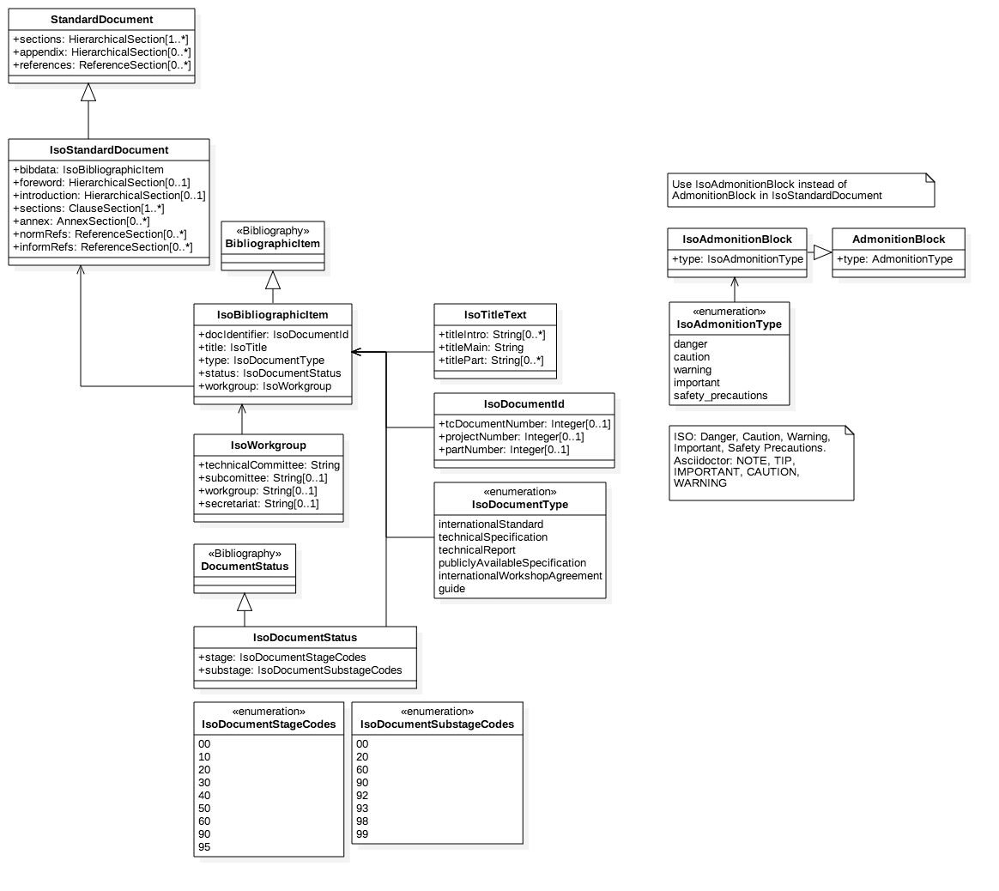

= IsoDoc Models

IsoDoc is a family of document models intended to represent ISO Standards and similarly structured standards. It is used to abstract the automated generation of standard documents in various formats from well-defined authoring tools; and to validate the structural conformance of authored standards to specifications.

The standards currently modelled via IsoDoc are:
* ISO Standards
* https://github.com/riboseinc/csd[CSD Standards].

The base Standard Document model includes information common to all standards in scope of IsoDoc. Models for individual standards are derived from the base model as subclasses, permitting changes in cardinality of attributes, and changes in their type. Below, we show the UML diagrams for the base model and for ISO; the CSD UML is shown on the CSD page.

The document models are expressed as UML and as RelaxNG Compact (RNC) grammars; see discussion under https://github.com/riboseinc/isodoc-models/tree/master/grammars[Grammars]. This repository contains the RNC grammars for the base Standard Document model, ISO Standards, and CSD.

The document models are currently used by Asciidoctor-based authoring tools for standards, which convert Asciidoctor source to XML representations of the document models, and validate the XML generated against the RNC schemas:

* https://github.com/riboseinc/asciidoctor-iso
* https://github.com/riboseinc/asciidoctor-csd

They are also used by tools that render those XML representations of the document models, into HTML and Microsoft Word:

* https://github.com/riboseinc/isodoc
* https://github.com/riboseinc/asciidoctor-csd (inheriting from isodoc)

== UML models

=== Standard Document Model

image::images/standard-document.png[]

=== ISO Standard Document Model

=== Bibliographic Models

image::images/bibliography.png[]

=== Terms and References Model

image::images/terms.png[]

=== Text Section Model

image::images/sections.png[]

=== Text Block Model

image::images/blocks.png[]

=== Text Model

image::images/text.png[]

