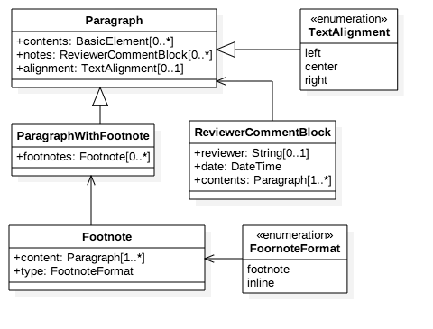

= IsoDoc Models

This is where we keep the IsoDoc model definitions.

== Standard Document Model

image::images/standard-document.png[]

== Bibliographic images

image::images/bibliography.png[]

== Terms and References Model

image::images/terms.png[]

== Text Section Model

image::images/section.png[]

== Text Block Model

image::images/blocks.png[]

== Text Paragraph Model

== Text Model

image::images/text.png[]

