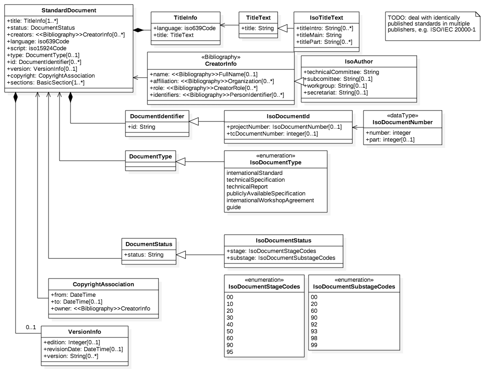
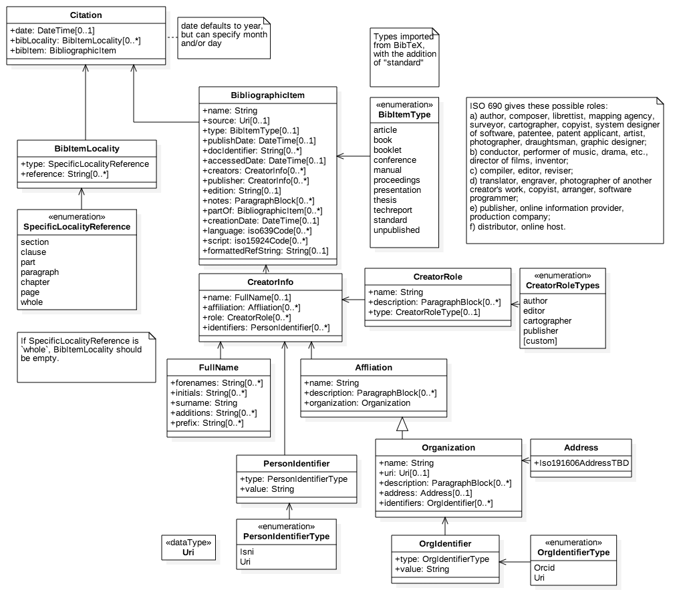
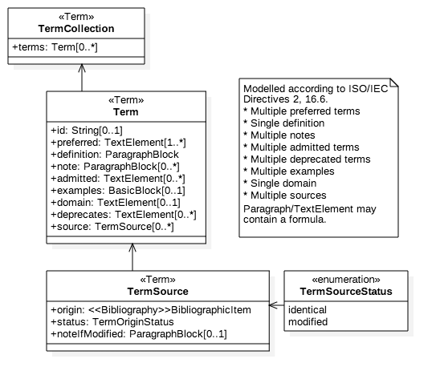
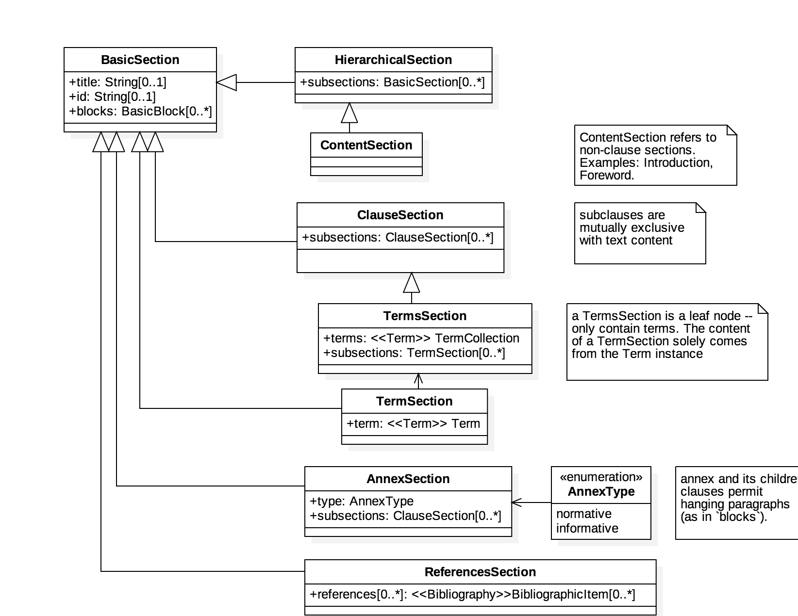
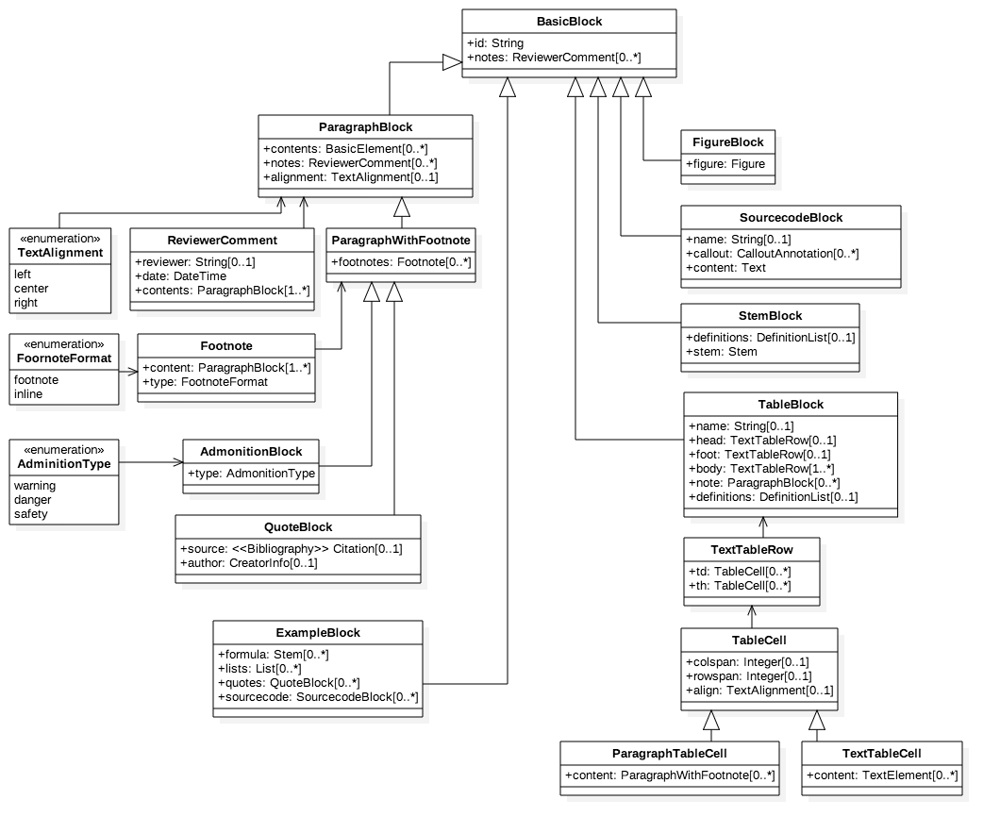
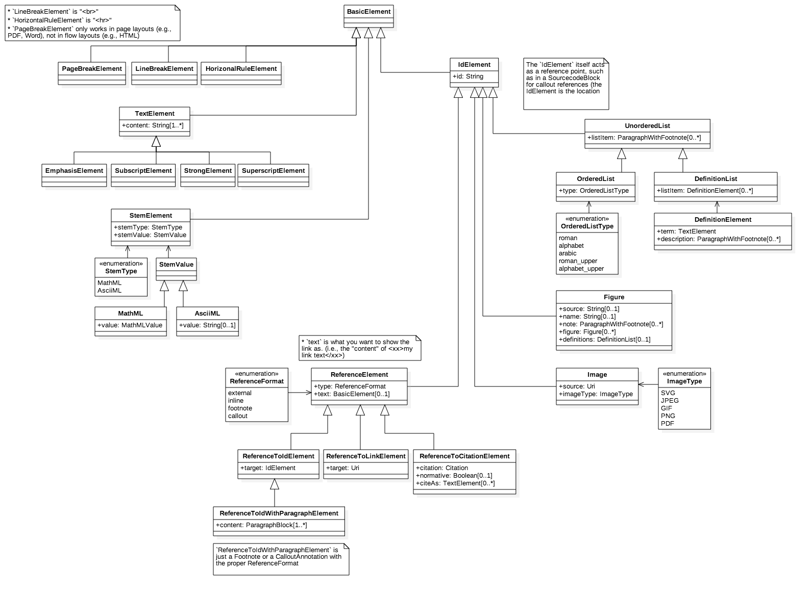

= IsoDoc Models

This is where we keep the IsoDoc model definitions.

== Standard Document Model

== Bibliographic images

== Terms and References Model

== Text Section Model

== Text Block Model

== Text Model

