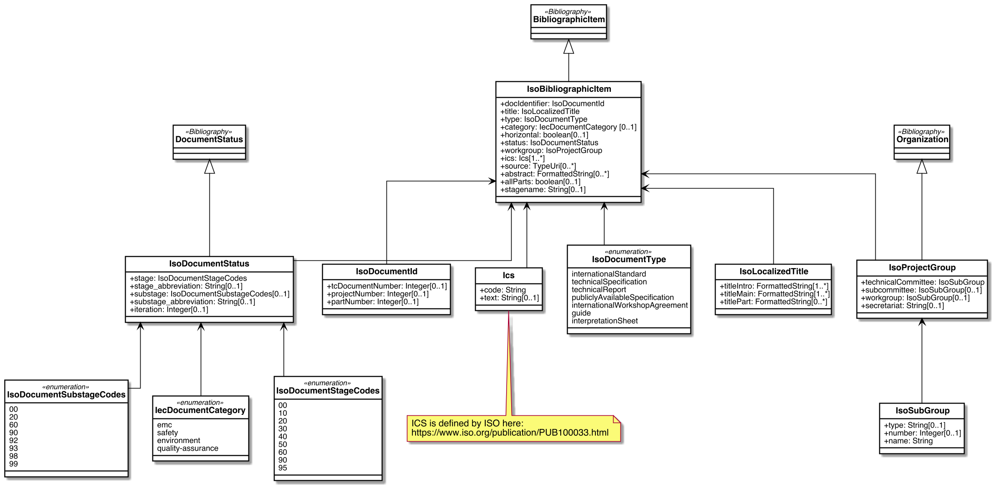
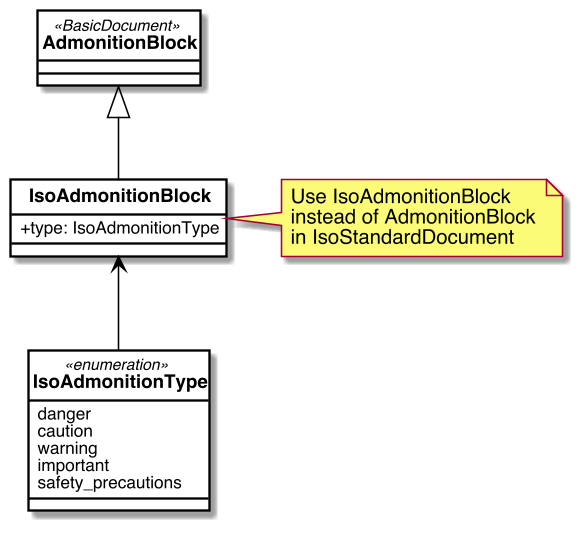
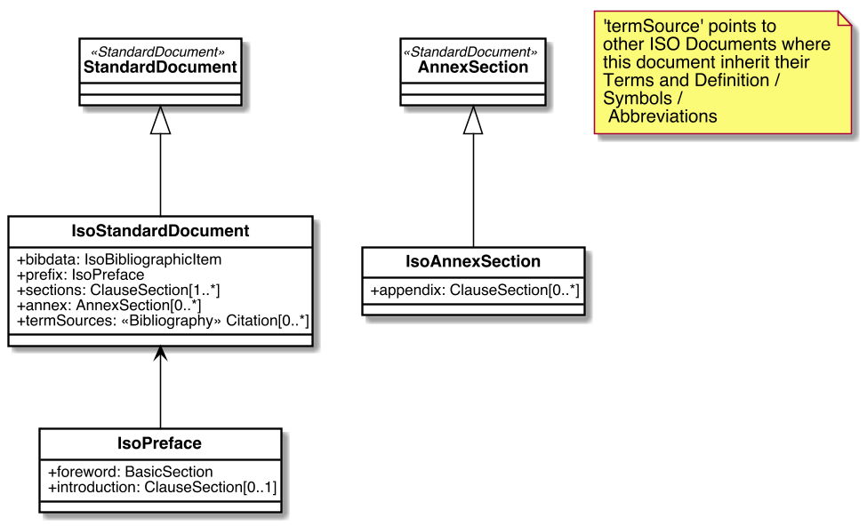

= Metanorma IsoDoc Models

Metanorma IsoDoc is a family of document models intended to represent ISO Standards and
similarly structured standards, based on the Metanorma StandardDocument ("StanDoc") and
BasicDocument ("BasicDoc") models.

It is used to abstract the automated generation
of standard documents in various formats from well-defined authoring tools; and
to validate the structural conformance of authored standards to specifications.

The standards currently modelled via Metanorma IsoDoc are:

* https://github.com/metanorma/metanorma-model-iso[ISO Standards]
* https://github.com/metanorma/metanorma-model-csd[CSD Standards]
* https://github.com/metanorma/metanorma-model-gb[Chinese Standards (GB and family)]

The base Metanorma StandardDocument model includes information common to all standards
in scope of IsoDoc. Models for individual standards are derived from the base
model as subclasses, permitting changes in cardinality of attributes, and
changes in their type.

Models it depends on include:

* Relaton Bibliography models: https://github.com/metanorma/relaton-models[Relaton BibModels]
* BasicDoc models: https://github.com/metanorma/basicdoc-models[BasicDoc]
* Metanorma StandDoc models: https://github.com/metanorma/metanorma-model-standoc[StanDoc]

Below, we show the UML diagrams for the base model and for ISO. The CSD, GB
diagrams are shown on their own respective pages.

The document models are expressed as UML and as RelaxNG Compact (RNC) grammars;
see discussion under
https://github.com/metanorma/metanorma-model-iso/tree/master/grammars[Grammars]. This
repository contains the RNC grammars for the base Standard Document model, ISO
Standards, CSD and China Standards.

The document models are currently used by Metanorma authoring tools for
standards:

* https://github.com/metanorma/metanorma-iso
* https://github.com/metanorma/metanorma-csd
* https://github.com/metanorma/metanorma-gb

They are also used by tools that render those XML representations of the
document models, into HTML and Microsoft Word:

* https://github.com/metanorma/isodoc

== ISO Standard Document UML Models

=== ISO Bibliographic Item

=== ISO Blocks

=== ISO Standard Document

