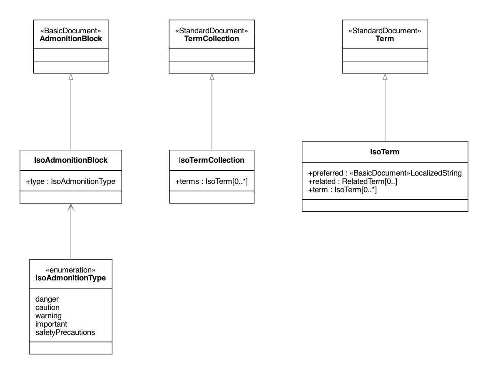

= Metanorma IsoDoc Models

image:https://github.com/metanorma/metanorma-model-iso/workflows/make/badge.svg["Build Status", link="https://github.com/metanorma/metanorma-model-iso/actions?query=workflow%3Amake"]

Metanorma IsoDoc is a family of document models intended to represent ISO Standards and
similarly structured standards, based on the Metanorma StandardDocument ("StanDoc") and
BasicDocument ("BasicDoc") models.

It is used to abstract the automated generation
of standard documents in various formats from well-defined authoring tools; and
to validate the structural conformance of authored standards to specifications.

The standards currently modelled via Metanorma IsoDoc include:

* https://github.com/metanorma/metanorma-model-iso[ISO Standards]
* https://github.com/metanorma/metanorma-model-iec[IEC Standards]
* https://github.com/metanorma/metanorma-model-cc[CalConnect Standards]
* https://github.com/metanorma/metanorma-model-bsi[BSI Standards]

The base Metanorma StandardDocument model includes information common to all standards
in scope of IsoDoc. Models for individual standards are derived from the base
model as subclasses, permitting changes in cardinality of attributes, and
changes in their type.

Models it depends on include:

* Relaton Bibliography models: https://github.com/metanorma/relaton-models[Relaton BibModels]
* BasicDoc models: https://github.com/metanorma/basicdoc-models[BasicDoc]
* Metanorma StandDoc models: https://github.com/metanorma/metanorma-model-standoc[StanDoc]

Below, we show the UML diagrams for the base model and for ISO.

The document models are expressed as UML and as RelaxNG Compact (RNC) grammars;
see discussion under
https://github.com/metanorma/metanorma-model-iso/tree/master/grammars[Grammars]. This
repository contains the RNC grammars for all Metanorma flavours, including ISO.

The document models are currently used by Metanorma authoring tools for
the various flavours it supports, such as:

* https://github.com/metanorma/metanorma-iso
* https://github.com/metanorma/metanorma-iec
* https://github.com/metanorma/metanorma-bsi
* https://github.com/metanorma/metanorma-cc

== ISO Standard Document UML Models

=== ISO Bibliographic Item

=== ISO Blocks

=== ISO Standard Document

